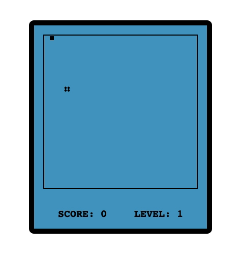

# 贪吃蛇小游戏

## 本项目适合谁？

初学者，你可以通这样一个简单的小项目来实践你新学习的技术嗷。仓库中会提供一些设计资料来帮助你实现它。如果仓库已经相关技术的实现，你可以通过阅读带有详细注释的源码来学习。

## 游戏设计

### 游戏设计稿

### 游戏玩法

从外观上来看，游戏有一个主要的游戏窗口，小蛇只能在这个窗口移动，小蛇有上下左右四个移动方向，对应键盘上的上下左右四个键来进行操作，但是小蛇不能掉头，也就是说小蛇每次可选的方向其实只有三个方向。在游戏窗口内会随机出现一个食物，小蛇需要吃掉它，这样身体就会成长一节，同时左下角的得分也会增加一分，随着小蛇分数的提升，每获得十分，等级就提升一级。等级越高，小蛇运动的速度就越快。一旦小蛇撞到游戏窗口边缘或者撞到自身，游戏便结束啦！

## 贡献

目前仓库以各类实现技术的命名文件夹，如果你成功用不同的技术实现了这个小游戏，十分欢迎你对这个仓库提交 Pr 来贡献你所实现的版本。